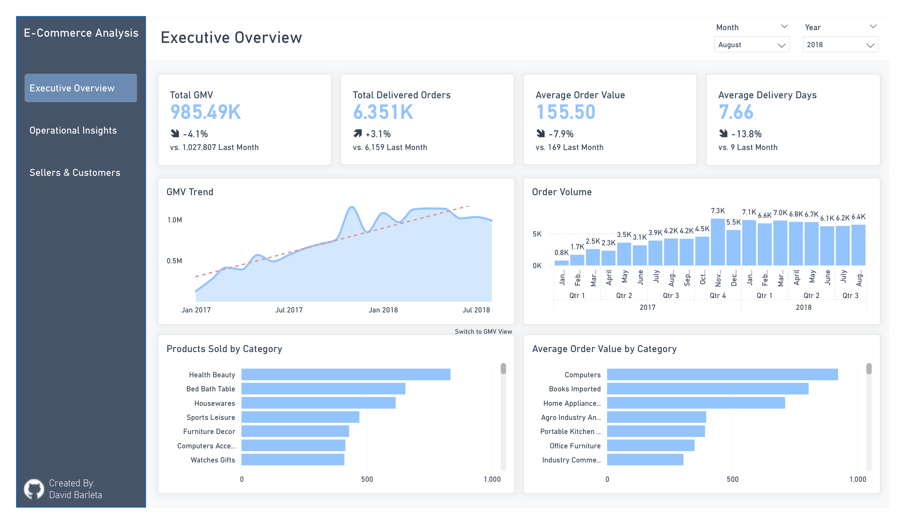
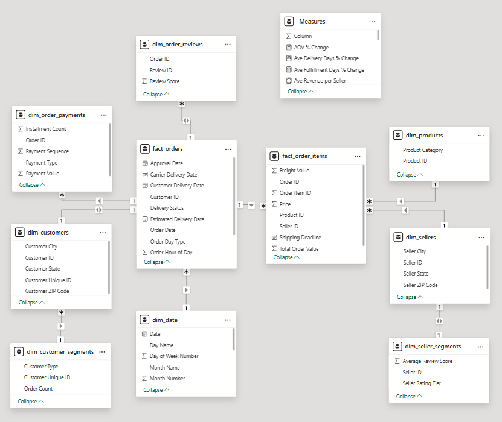
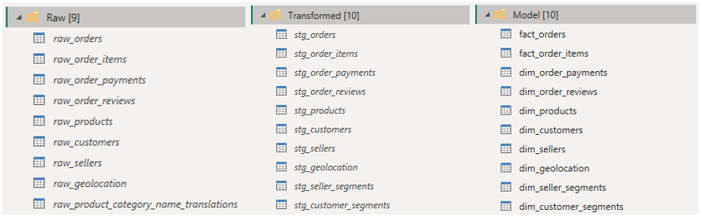
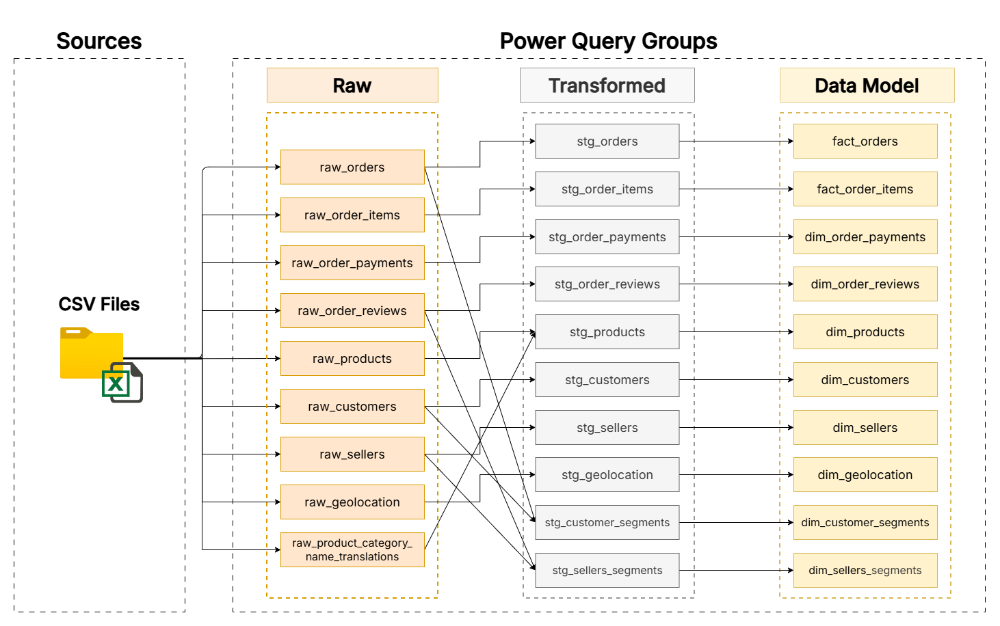

# E-Commerce Analysis

## Executive Summary
This project analyzes over 96K delivered orders transacted through Olist's Brazilian e-commerce platform between January 2017 and August 2018, covering 13.2M in GMV across 3,095 sellers and 93,104 unique customers. The analysis showed that GMV grew nearly 8x through 2017 driven entirely by order volume, with no meaningful AOV growth, while the platform demonstrated strong operational performance. However, three risks stand out: customer retention is significantly low, logistics reliability had not yet been fully stabilized, and revenue is heavily concentrated. Together, these findings point to a platform that successfully achieved early scale but faces an important strategic decision: whether to pursue geographic expansion, double down on seller and customer retention, or invest in logistics partnerships needed to sustain its growth.

## Project Background
Olist was founded in February 2015 with the mission to empower small and medium-sized businesses in Brazil by providing a unified platform for selling their products online. Operating as a B2C marketplace, Olist connects professional sellers to customers through a single storefront rather than requiring each seller to build and manage their own. Olist's primary revenue streams are seller subscription fees and transaction-based commissions. Sellers pay a monthly fee to access the platform, and Olist takes a percentage cut of each completed transaction. Hence, one of the key metrics for evaluating Olist's scale and growth is Gross Merchandise Value (GMV), which represents the total value of goods transacted through the platform.

This project analyzes the Olist Brazilian E-Commerce Public Dataset, sourced from Kaggle, covering the period from 2016 to 2018. The goal is surface actionable business insights four key areas: revenue and growth trends, operational and logistics performance, product and category analysis, and customer and seller behavior. The analysis is presented through an interactive Power BI dashboard and is intended to demonstrate the application of business intelligence/analytics to real-world e-commerce business operations.

## Data Structure & Initial Checks
The dataset consists of eight CSV files covering orders, order items, payments, reviews, products, customers, sellers, and geolocation. Primary key uniqueness was verified across all tables using Power Query's Keep Duplicates function. Most tables returned clean results, with expected duplicates in order items (multiple items per order) and order payments (multiple payment methods per order). One exception was `order_reviews`, where duplicate `review_id` values were found, which suggests that either accidental double recording or a single review being associated with multiple orders. Additionally, 775 orders in `orders` had no corresponding records in `order_items`, which likely represents cancelled or unprocessed orders that never had items recorded against them.

`NULL` and out-of-range values were also checked across all tables. Most NULL values in `orders` were concentrated in date columns like `order_delivered_carrier_date` and `order_delivered_customer_date`, and their distribution across order statuses confirmed that they were expected rather than data errors. In products, 610 records had a `NULL` `product_category_name`, which were replaced with "`Uncategorized`" to ensure consistent grouping in analysis. Review comment fields in order_reviews contained a large number of empty strings, which were standardized to NULL before any transformations were applied. No impossible values were found, such as negative prices or delivery dates earlier than order dates, confirming the dataset is reliable for analysis.

Although the timeframe of the orders starts from September 2016, the data for 2016 only contains 3 months: September, October, and December. September & December only contain 1-5 orders, while November is completely missing. Hence, the 2016 data can't be reliably used for trend analysis, as the data effectively starts in January 2017 for meaningful insights.

### Data Model

The final data model in Power BI is shown above. The main fact table is the `fact_order_items` table, while the `fact_orders`, which is a "factless" fact table, serves a bridge table that connects the records in the `fact_order_items` table to the other dimension tables. 

Two summary tables were also created: `dim_seller_segments`, which groups sellers by the average review scores for their products, and `dim_customer_segments`, which groups customers by their order count.

### Queries Structure

The query structure (shown above) is divided into three groups:
1. Raw group: source connections/references
2. Transformed group – transformations done:
	- data cleaning
	- data enrichment:
	- data standardization
	- data integration
	- data aggregation
3. Model group:  The tables were categorized into either a fact table or a dimension table, and the column names were renamed to more readable, business-friendly names.

### Data Flow

## Insights Deep Dive
### Executive Overview
**Q1: How has total GMV trended over time, and is the transaction activity in the platform growing?**
- Total GMV reached 15.37M across January 2017 to August 2018, with a total of 96.21K delivered orders at an average order value of 161.
- The platform grew 8x in 2017, with GMV scaling from 127.48K in January 2017 to 1.15M in November 2017. The revenue spike in November 2017, which is aligned with the Black Friday sale, also marked the peak of the GMV.
- By 2018, the monthly GMV stabilized in the 960K to 1.130M range through August, which suggests that the business's phase had transitioned from high early growth to a mature, steadier phase. 
- The full total GMV in 2017 was 6.92M, while the total GMV in 2018 (only up to August) was 8.45M. This implies an annualized **run rate** of roughly 12.7M, which would indicate a 83% year-over-year growth from 2017 if the pace of monthly GMV held through December 2018.
- The GMV trend also shows a drop in June for both 2017 and 2018, with a 10%-13% decline in GMV and 9%-11% decline in orders from May to June, although this is followed by a partial recovery in July. The AOV barely moves during this period, which suggests that this is driven by order volume and likely a seasonal pattern.

**Q2: How many orders were placed per month, and does order volume track with revenue?** 
- Order volume moved almost perfectly in sync with the revenue, which suggests that the business's revenue growth was primarily driven by order volume, not by customers spending more per order.
- During the 2017 growth phase, monthly orders scaled from 750 in January to a peak of 7.29K in November, which mirrored in the revenue growth in the same period.
- The average order value was somewhat fluctuating in 2017 during the business's early growth, ranging from 153 to 173, but stabilized in the 160+ range by 2018. This suggests the platform's product mix and pricing had matured by then, with no meaningful drift in either direction. ***(revise this part)***
- Similar to the GMV trend in 2018, order volume also plateaued in 2018, with the monthly orders settled in the 6K to 7K range. Since the two metrics moved together, AOV remained stable instead of increasing, which suggests that the business hasn't yet found a different strategy to grow revenue independently of order volume. 

**Q3: Which product categories generate the most GMV and have the highest order volume?**
**Q4: What is the average order value, and how does it vary by product category?**
- The product category rankings shift depending on the whether they are sorted by revenue or items sold. 
- By items sold, Bed Bath Table is the top selling product with 10.9K delivered orders, ahead of Health Beauty at 9.4K These are followed by Sports Leisure (8.4K), Furniture Decor (8.1K), and Computers Accessories (7.6K). These five categories account for majority of the total order volume, while the long tail of the product category list contains categories with less than 200 items sold across the entire timeframe. This distribution represents a typical online marketplace platform where order volume is concentrated on a small number of popular categories.
- By revenue, the ranking is different. Health and Beauty moves to the top at 1.412M, followed by Watches Gifts at 1.264M, Bed Bath Table at 1.225M, Sports Leisure at 1.118M, and Computer Accessories at 1.033M.
- The most notable shift is Watches Gifts, which jumped to 2nd in revenue despite ranking 7th in items sold. This is driven by the category's inherently higher price points. With individual item prices ranging from 8.99 to 3,999.90, and a median of 129, the category contains a mix of affordable gift items and genuine watches that skew the AOV to 232 per order. It's worth noting that the product type itself drives higher prices, which is what increases its AOV rather than a particular customer spending behavior.
- The total AOV across all products is at 160, but it greatly varies by category. For instance, Computers tops the list at 1.29K per order, followed by Small Appliances Home Oven and Coffee at 669, and Home Appliances at 530. At the bottom are Home Comfort (49), Flowers (55), and Diapers And Hygiene (77), which are all below the total AOV.
- Understanding what drives a category's AOV matters before drawing conclusions from it. A high AOV can mean two different things: either the products in that category are consistently expensive, or a small number of highly priced items are pulling the average upwards while the usual item prices stay at average prices.

### Operational Insights
**Q5: What is the average delivery time, and how has it changed over time?** 
- The average delivery days fluctuated throughout the timeframe of the data. It started at 12.75 days in January 2017, worsened to 16.88 days in February 2018, and then improved to 7.66 days by August 2018. The downward trend starting from February 2018 suggests that that 
- Two spikes in the trend are worth highlighting. The first occurred in November and December 2017, where the average delivery days rose up to 15.07 and 15.31, respectively. This coincided with the Black Friday volume surge and subsequent holiday season. The platform processed its highest order volumes in 2017 during the said months, so the logistics clearly struggled to keep up with the demand. 
- The second, larger spike happened in February and March 2018, reaching 16.88 and 16.24 days, respectively. This is a bit difficult to attribute to a single event since order volumes in the said months were not unusually high. This suggests a logistics or carrier capacity issue rather than a problem with keeping up with the demand.

**Q6: How often do orders arrive later than the estimated delivery date (on time vs. late orders), and how fast do sellers complete the fulfillment of orders?** 
- The average fulfillment days across 2017 to 2018 is 3.19, and it stayed consistently low throughout the entire period, ranging between 2.6 and 4.0 days across all months. This shows that the platform sellers were processing and fulfilling orders reliably, and the bottleneck can be entirely attributed on the carrier delivery side, not on the seller side.
- Out of 96,203 delivered orders, 88,381 arrive on time (91.87%) and 7,822 arrived late (8.13%). The overall on-time rate is high, but the monthly breakdown reveals that late delivered were not evenly distributed across the period and spiked significantly during specific months.
- The worst months for late deliveries were: March 2018 (1,496), February 2018 (1,048), and November 2017 (1,043). These three months alone account for roughly 46% of all late deliveries across 2017 to 2018, despite representing only 3 out of 20 months. The November 2017 data is consistent with the Black Friday volume surge identified in Q5, while February and March 2018 are more concerning since order volumes in those months were not unusually high, yet late deliveries nearly matched the Black Friday spike.
- By contrast, June 2018 had only 83 late orders despite processing 6,096 delivered orders, an on-time rate of 98.64% and the best performance in the data. The second half of 2018 shows a more improved performance, which is consistent with the delivery time improvements discussed in Q5.

**Q7: What is the freight cost as a percentage of GMV by category, and which categories are most freight-intensive?**
- Freight value varies across categories, from as low as 4.2% for Computers to as high as 35% for Home Comfort 2. This measure represents freight as a share of total customer spend (product price + freight value). Hence, it answers the question: for every 1 currency that a customer pays, how much goes to shipping?
- The most freight-intensive categories are Home Comfort 2 (35%), Flowers (31%), Diapers and Hygiene (28%), Furniture Mattress and Upholstery (27%), and Christmas Supplies (27%). At the other end, the most freight-efficient categories are Computers (4.2%), Small Appliances Home Oven and Coffee (5.4%), Fixed Telephony (7.5%), Agro Industry and Commerce (7.4%), and Watches Gifts (7.8%). These categories generate strong GMV per transaction while keeping the freight costs proportionally low, which makes them the most economically efficient categories on the platform for both sellers and customers.

**Q8: How does order volume and GMV vary by state, and which states are underserved?**
- Platform activity is heavily concentrated in the Southeast, with Sao Paulo (SP) alone accounting for 37% of total GMV at 5.8M across 40.5K orders, followed by Rio de Janeiro (RJ) at 13% and Minas Gerais (MG) at 12%. The South region (RS, PR, SC) contributes a combined 15%, making the two aforementioned regions responsible for over 77% of all platform GMV. Beyond these regions, order activity drops off for the remaining states. The most underserved states (RO, AM, AC, AP, RR) account for only less than 1% of the total GMV.

### Sellers & Customers
**Q9: Is revenue concentrated among a small number of sellers, and what's the risk of seller dependency?**
- The top 100 sellers out of 3,095 total account for 45% of total GMV, meaning that less than 4% of the seller base drives nearly half of all the platform GMV. The remaining 2,995 sellers split the other 55%, which shows a long tail of smaller sellers each contributing a fair share. This concentration is typical of marketplace platforms, but reveals a dependency risk: if a large portion of the top sellers were to reduce activity or lose to competitors, the impact on GMV would be disproportionate relative to their number.

**Q10: What's the distribution of customer review scores?**
- Out of 96K delivered orders, 57K (59%) received a 5-star rating and 19K (20%) received 4 stars, meaning roughly 79% of orders were rated positively. Scores of 1 and 2 account for a combined 13% (9K and 3K respectively), while 3-star reviews make up the remaining 8%. The distribution is heavily skewed toward positive satisfaction, which is a strong signal of overall platform and seller performance. However, the 9.8% of 1-star reviews warrants attention as it likely reflects the same delivery issues identified in Q5 and Q6.

**Q12: How does delivery time affect the review scores?**
- The relationship between delivery time and review scores is clear: orders rated 5 stars averaged 10.6 delivery days, while 1-star orders averaged 21.2 days, nearly double. The pattern holds across every score: 2-star orders averaged 16.6 days, 3-star orders 14.2 days, and 4-star orders 12.2 days. Given that 59.2% of orders received 5 stars and the platform's average delivery time was 12.5 days, it shows that faster delivery is one of the strongest predictors of customer satisfaction. 

**Q13: How do review scores affect seller revenue performance?**
- Medium-rated sellers (3 stars) generated higher average GMV per seller at 5,283 compared to high-rated sellers (4-5 stars) at 4,495, while low-rated sellers (1-2 stars) trailed significantly at 1,291. The gap between low and the other two tiers is substantial and consistent with what Q12 revealed: poor ratings correlate with longer delivery times, which likely drives both lower customer satisfaction and reduced repeat purchasing. 
- The medium-rated sellers on the other hand averaged 41.9 orders per seller vs. 32.4 for high-rated sellers. They're actually more active sellers on average, and more orders means more exposure to diverse customers and more chances to received a mixed review. This could be the reason why they're rated medium rather than high in the first place.

**Q15: How many customers are repeat buyers vs. (one-time buyers), and what share of revenue do they contribute?** 
- One-time buyers dominate the platform almost entirely. Out of 93,104 unique customers for delivered orders, 93K (97%) placed only a single order, contributing 94% of total GMV. Returning customers account for just 3% of the customer base (6K customers) yet contribute 6% of GMV, which means that they spend more per customer than one-time buyers. The huge share of one-time buyers suggests that the platform was still heavily dependent on new customer acquisition during their early growth period, with very limited repeat purchase behavior. 

## Recommendations
Based on the insights and findings above, the following recommendations are given:

**Growth & Revenue Strategy**
- GMV and order volume growth slowed into a plateau by mid-2018, suggesting that the platform may have moved past its early high growth phase. The business should investigate whether this reflects market saturation in existing regions, increased competition, or supply-side limitations, and consider whether the current growth strategy remains appropriate given the shift.
- GMV growth is almost entirely driven by order volume, with AOV remaining flat for over a year. The platform should explore opportunities with sellers on whether strategies such as bundling, upselling, or curated product recommendations could grow revenue per transaction, rather than relying solely on acquiring new orders.
- The platform shows strong seasonal spikes every November, consistent with Black Friday demand. The business should explore promotional planning and ensure that logistics capacity and seller readiness can keep up with high-demand periods.

**Category Management**
- Bed Bath Table and Health Beauty consistently rank at the top in both GMV and items sold. Given the impact these two categories have on overall platform performance, maintaining seller quality and logistics reliability in these categories should be a priority.
- High order volume categories like Electronics and Telephony generate relatively low GMV due to the inherently low prices of the products listed. Attracting sellers who carry higher-value products within these categories could improve revenue contribution without requiring growth in transaction volume.

**Logistics & Operations**
- Average delivery days improved significantly in the second half of 2018, nearly halving from its peak. The business should identify and document what drove this improvement so that the contributing factors can be sustained as the platform scales.
- Late deliveries spiked in November 2017 alongside the Black Friday volume surge, suggesting that carrier capacity was insufficient to keep up with the demand. The business should assess whether logistics partnerships and carrier agreements are structured to accommodate high demand periods which are predictable.
- A separate spike in late deliveries occurred in February and March 2018 without a corresponding increase in order volume, pointing to possible issues with logistics. The business should investigate whether this risk has been addressed or whether it remains a potential recurring problem.

**Customer & Seller Health**
- 97% of customers placed only a single order during the dataset period, with returning customers contributing a slightly higher GMV share per customer. The business should evaluate whether customer retention initiatives could greatly improve GMV growth without the cost of acquiring entirely new customers.
- The top 100 sellers account for nearly 45% of total GMV despite representing less than 4% of the seller base. This concentration creates a dependency risk where the exit or poor performance of these high-performing sellers might have an impact on the overall platform's revenue.
- Low-rated sellers (1-2 stars) generate significantly lower average GMV per seller compared to Medium and High-rated tiers. The business should consider whether seller quality standards or performance-based support programs could help underperforming sellers improve, or whether continued platform presence by consistently low-rated sellers creates reputational risk.

## Assumptions and Caveats
Multiple assumptions were made throughout the analysis to manage challenges with the data. These assumptions and caveats are given below:

- **GMV definition:** GMV is defined as the total customer spend per order, including both product price and freight value. 
- **Analysis period:** All insights and figures are based on 2017 to 2018 data only. The 2016 data (September to December) was excluded due to its incompleteness, with only 267 delivered orders across the three months and November entirely missing. 
- **Delivered orders only:** Most of the insights are based on measures which are filtered to delivered orders only.

# Limitations
- **No cost or profitability data:** The dataset provided by Olist doesn't include the platform's commission rates, operational costs, or seller subscription fees. Hence, profitability, margins, and actual revenue can't be determined from the analysis done.
- **No marketing or acquisition data:** Other important KPIs in e-commerce, like CAC and CLV, cannot be computed as the dataset contains no information on marketing spend or customer acquisition channels.
- **Incomplete 2018 data:** The dataset ends in August 2018, which means that Q4 2018 is not captured at all. Given that November 2017 was the strongest month in the entire dataset due to Black Friday, the absence of Q4 2018 most likely means that the total GMV for 2018 is understated relative to what the full year would show.
- **Dataset doesn't represent Olist's full early operating history:** Based on publicly available information, Olist launched in February 2015. The dataset only covers September 2016 onwards, which means that approximately 18 months of early operating history is not reflected in this analysis.

# Future Work
- **Deeper customer retention analysis:** Apply RFM (recency, frequency, and monetary value) analysis to allow for more customer segmentation beyond the one-time vs. returning buyer classification used in this project. While frequency and monetary components are available in this dataset, recency is constrained by the dataset's end date.
- **Seller churn analysis:** Identify sellers who were active early in the dataset period but became inactive over time to surface early warning signals for seller attrition. Given that the top 100 sellers account for nearly 45% of total GMV, understanding which seller characteristics predict churn would be an extension of the seller concentration analysis in this project.
- **Additional metrics:** Metrics such as cancellation rate and average order processing time would add meaningful operational depth. Some of these could be incorporated in a future version of this project considering that the necessary data, such as order status and timestamps, is already available in the dataset.
- **Query performance optimization:** DAX measures in this model were written for correctness and clarify rather than performance. For a larger dataset or a production environment, some measures could be optimized using pre-aggregated calculated columns or alternative DAX patterns to reduce query execution time.
- **Data modeling improvements:** The current data model classifies `dim_order_payments` and `dim_order_reviews` as dimension tables for modeling convenience. In a stricter star schema design, these tables may not exactly be treated as pure dimension tables.
- **Geolocation analysis:** The dataset includes latitude and longitude coordinates at the ZIP code level for both customers and sellers. A map-based analysis of delivery performance, GMV concentration, and underserved regions would allow for more insights.